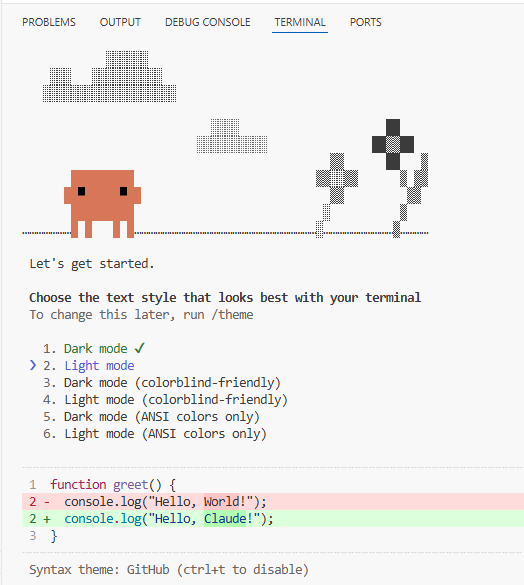
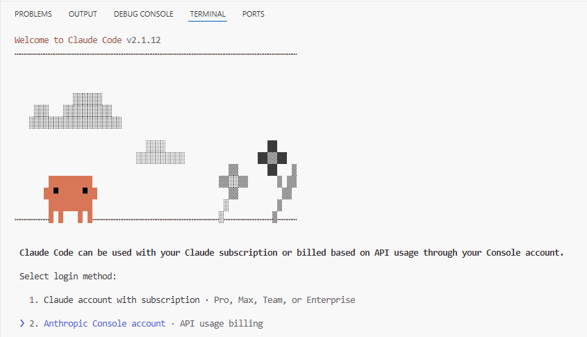
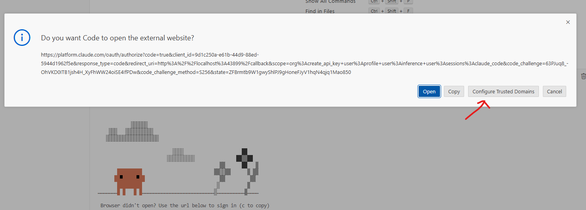
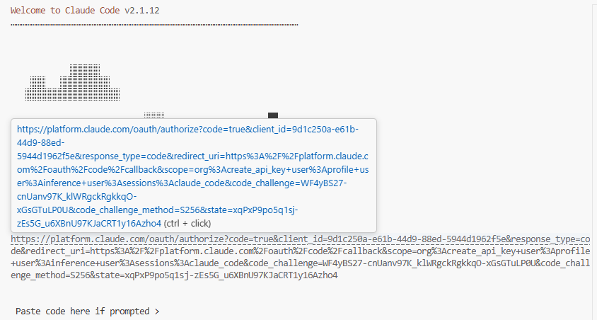
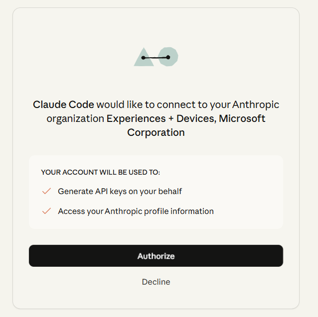
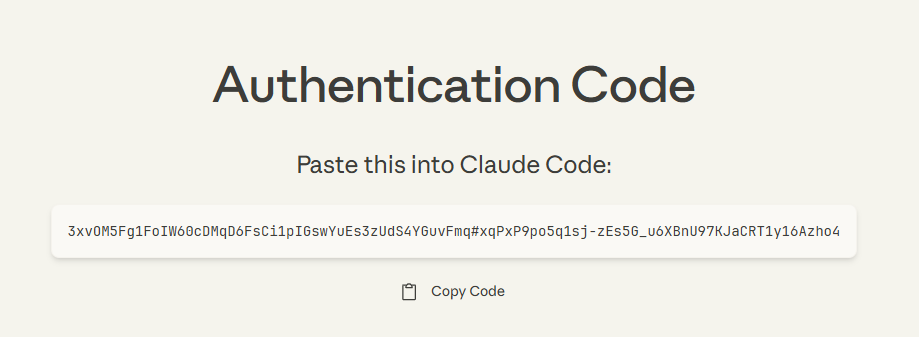
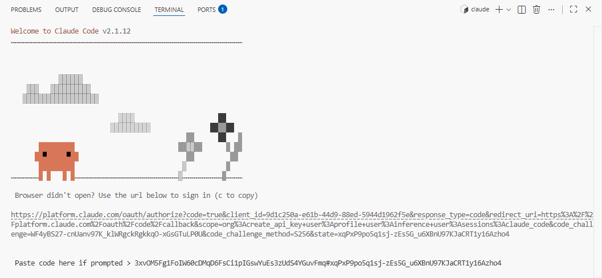
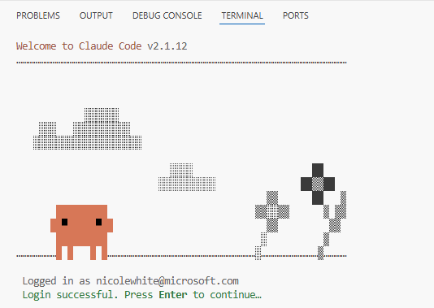

<!-- BEGIN MICROSOFT-FDE BLOCK -->
<!-- WARNING: This section is autogenerated - changes will be overwritten when regenerated by https://github.com/microsoft/fde-mgmt -->
# GitHub Codespaces

[GitHub Codespaces](https://docs.github.com/en/codespaces/about-codespaces/deep-dive) are cloud environments where we can run Visual Studio Code in the browser.

## Creating a codespace

You can create a codespace either in the browser or from the terminal.

### Via the browser

Navigate to the repository's homepage and click on the green **Code** button. Go to the **Codespaces** tab and click **Create codespace on main**.


### Via the terminal

You can create codespaces in the terminal via [`gh cs create`](https://cli.github.com/manual/gh_codespace_create). For example:

```bash
gh cs create --repo microsoft/fde-abc
```

> [!TIP]
> Creating a codespace from scratch takes a few minutes and there is also a limit on how many codespaces a user can have. We recommend keeping a **single active codespace per repository**. You can check out multiple feature branches and open multiple pull requests from a single codespace (just like you would from your local machine).

## Viewing your codespaces

### Via the browser

You can view all of your codespaces across repositories at https://github.com/codespaces.

### Via the terminal

You can also view them from the terminal via [`gh cs list`](https://cli.github.com/manual/gh_codespace_list).

## Port forwarding

When working on applications in your codespace, `localhost` ports will be automatically forwarded so that you can view them in the browser.

From the [docs](https://docs.github.com/en/codespaces/developing-in-a-codespace/forwarding-ports-in-your-codespace):

> When an application running inside a codespace prints output to the terminal that contains a localhost URL, such as http://localhost:PORT or http://127.0.0.1:PORT, the port is automatically forwarded. If you're using GitHub Codespaces in the browser or in Visual Studio Code, the URL string in the terminal is converted into a link that you can click to view the web page on your local machine. By default, GitHub Codespaces forwards ports using HTTP.

## Sharing a port

By default, the automatically-forwarded port is private to you. To share with others, you can make the port **public** either from the browser or from the terminal.

### Via the browser

Follow the instructions [here](https://docs.github.com/en/codespaces/developing-in-a-codespace/forwarding-ports-in-your-codespace#sharing-a-port).

### Via the terminal

* Find your codespace's ID. This is the portion of your codespace's URL prior to `github.dev`. For example, for a codespace at `https://turbo-funicular-wrjg5p4p4r9wh5q7x.github.dev`, the codespace ID is `turbo-funicular-wrjg5p4p4r9wh5q7x`.
* Find the port you want to forward. This is typically where a frontend application is running, such as `3000` or `5173`. You can find this in your codespace's **Ports** tab.
* Make the port available to anyone in the `microsoft` GitHub organization to view via [`gh cs ports visibility`](https://cli.github.com/manual/gh_codespace_ports_visibility): `gh cs ports visibility 3000:org -c <codespace-id>`.

## Claude Code

You can use Claude Code with your Microsoft login within a codespace.

> [!TIP]
> The Claude CLI is installed automatically when your codespace is created.

### Start the interactive CLI

To login with your Microsoft account, start the interactive CLI in the codespace terminal:

```bash
claude
```

### Choose your theme

It will first ask you to choose your theme:



### Select login method

It will then ask you to choose your login method. Choose **2. Anthropic Console account**:



### Configure trusted domain

You will see a popup titled **Do you want Code to open the external website?**. Click on the gray **Configure Trusted Domains** button, then select the first option **Trust https://platform.claude.com**.



### Open authorization URL

Ctrl + click on the URL the CLI printed to the terminal:



### Authorize app

Click **Authorize**:



### Copy code

Copy the authentication code:



### Paste code

Paste the code into the waiting terminal:



Press enter. You should now be logged into Claude Code via your Microsoft login:



<!-- END MICROSOFT-FDE BLOCK -->
