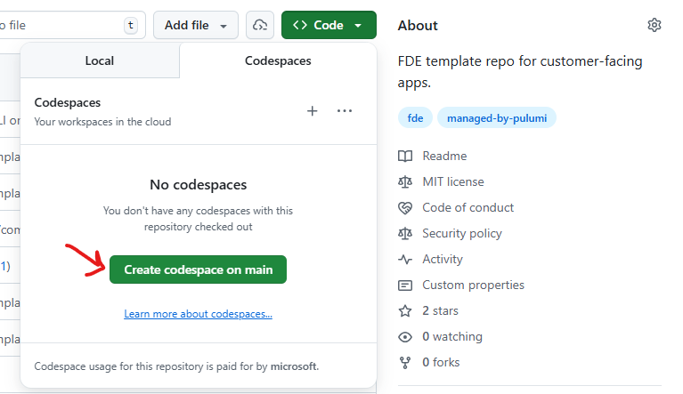

# Development Environment

This repo includes a [devcontainer](https://containers.dev/) configuration that works with GitHub Codespaces, VS Code Dev Containers, or any devcontainer-compatible environment.

## Using GitHub Codespaces

Navigate to the repository homepage and click the green **Code** button. Go to the **Codespaces** tab and click **Create codespace on main**.



Or from the terminal:

```bash
gh cs create --repo microsoft/be-an-fde-for-a-day
```

## Using VS Code Dev Containers

1. Install the [Dev Containers extension](https://marketplace.visualstudio.com/items?itemName=ms-vscode-remote.remote-containers)
2. Clone the repo locally
3. Open the repo in VS Code → it will prompt you to reopen in a container

## Using Your Own Local Environment

If you prefer not to use a devcontainer, install the following:

- Python 3.12+ and [uv](https://docs.astral.sh/uv/)
- Node.js 22+ and [pnpm](https://pnpm.io/)
- [Pulumi](https://www.pulumi.com/docs/install/) (if deploying infrastructure)

Then run:

```bash
cd py && uv sync
cd ts && pnpm install
uvx pre-commit install
```

## Port Forwarding

When working in a cloud-hosted environment, `localhost` ports are automatically forwarded so that you can view them in the browser.

