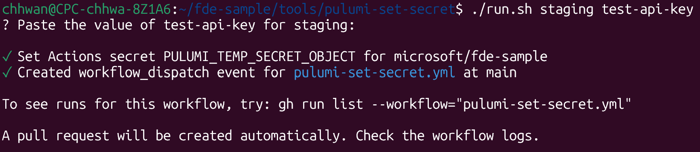

# Setting Pulumi Secrets

> [!WARNING]
> This directory is autogenerated - changes will be overwritten when regenerated by https://github.com/microsoft/fde-mgmt.

It is sometimes necessary to store [encrypted secrets](https://www.pulumi.com/docs/iac/concepts/secrets) in Pulumi config files, such as API keys for third party services like WhatsApp or Twilio. This allows you to consume those secrets in your Pulumi scripts:

```py
import pulumi

config = pulumi.Config()

whatsapp_api_key = config.require_secret("whatsapp_api_key")
```

You can then use this value to configure resources that require the secret.

## Prerequisites

* Install the [**GitHub CLI**](https://cli.github.com) and [authenticate with this repository](https://cli.github.com/manual/gh_auth_login).
* Install the [**Pulumi CLI**](https://www.pulumi.com/docs/iac/download-install) (only necessary for `dev` stacks).

## `dev` stacks

To set a Pulumi secret in your personal dev stack, you can use the `pulumi config set` command with the `--secret` flag:

```bash
pulumi config set --secret <secret-name> <secret-value>
```

This will store the secret in the Pulumi config file, encrypted with the passphrase you set when you created the stack.

## `staging` and `production` stacks

For staging and production stacks, the encryption key is stored as a GitHub secret. This means that we can't set the secret directly from our local machines using the `pulumi config set` command, as the encryption key is not available locally. Instead, we remotely trigger a GitHub Actions workflow that sets the secret in the appropriate Pulumi stack.

To do so, run the `run.py` script in this directory. It will first ask you to paste the value of the secret, then trigger the GitHub Actions workflow:

```bash
./run.py --stack <staging|production> --secret-name <name> [--project <name>] [--secret-value <value>]
```

Options:
- `--project` — Name of the Pulumi project under `infra/` (e.g. `app`, `platform`). Defaults to `app`.
- `--stack` — The Pulumi stack to set the secret in (`staging` or `production`).
- `--secret-name` — The name of the Pulumi secret to set.
- `--secret-value` — The secret value. If not provided, you will be prompted to paste it interactively.

For example:

```bash
# Set a secret in the default project (infra/app)
./run.py --stack staging --secret-name whatsapp_api_key

# Set a secret in a specific project (infra/projects/platform)
./run.py \
  --project platform \
  --stack staging \
  --secret-name whatsapp_api_key
```

A PR will automatically be created for you with the changes to the provided Pulumi stack config.


